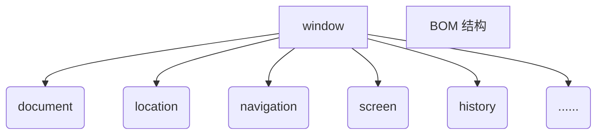

# BOM 概述

## 1. 定义

> BOM（Browser Object Model）即==浏览器对象模型==。它提供了独立于页面，而与浏览器窗口进行交互的对象。其核心对象是 window。

> BOM 由一系列相关的对象构成，并且每个对象都提供了许多的方法和属性。

> BOM 缺乏标准：
>
> - JavaScript 语法的标准化组织是 ECMA ；
> - DOM 的标准化组织是 W3C ；
> - BOM 最初是网景公司（Netscape）浏览器标准的一部分。

## 2. BOM 与 DOM 的对比

| DOM                                    | BOM                                                    |
| -------------------------------------- | ------------------------------------------------------ |
| 文档对象模型                           | 浏览器对象模型                                         |
| DOM 把==文档==当作一个==对象==来看待； | BOM 把==浏览器==当作一个==对象==来看；                 |
| DOM 的顶级对象是 ==document；==；      | BOM 的顶级对象是 ==window==；                          |
| DOM 主要用来操作页面的元素；           | BOM 主要用来进行浏览器窗口交互；                       |
| DOM 是 W3C 制定的标准规范。            | BOM 是浏览器厂商在各自浏览器上定义的规范，兼容性较差。 |

## 3. BOM 的构成

BOM 比 DOM 更大，它包含 DOM。

### 3.1 window 对象

window 对象是浏览器的顶级对象，它具有双重角色：

- 它是 JavaScript 访问浏览器的一个接口；
- 它是一个全局对象。定义在==全局==作用域中的==变量和函数==都会变成 ==window== 对象的==属性和方法==：
  - 在调用变量和函数时可以省略 window；
  - window 有一个特殊属性 name，所以不要以 name 命名变量。